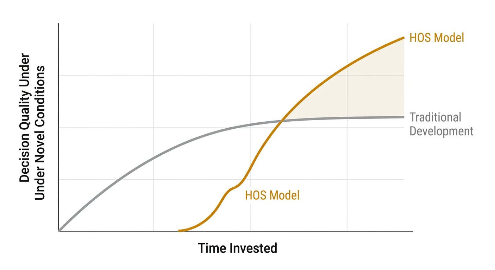

# Section 1 — The Problem: Why Knowledge Is No Longer Enough

---

## 1.1 The Shifting Demand on Professionals

Something fundamental has changed in the structure of professional value.

For most of the twentieth century, the path to professional authority was relatively predictable: spend years acquiring deep expertise in a single discipline, accumulate credentials that signal that expertise, and then apply it within a stable enough environment that the expertise remained relevant throughout a career.

That stability is gone.

Product cycles that once spanned years now compress into quarters. Entire job categories are being augmented or restructured by generative AI within months of a tool reaching mainstream adoption. Market conditions that once held for a decade shift within a single funding cycle. The practitioner who was the most informed person in the room last year may find that the room has moved entirely this year.

The demand has shifted from *depth alone* to *depth plus adaptability*. Organisations are increasingly rewarding those who can hold expertise in one domain while rapidly acquiring functional fluency in adjacent ones — the product manager who can read engineering constraints, the marketer who understands unit economics, the designer who can pressure-test a business model.

This is not a new observation. What is new is the *rate* at which this demand is accelerating — and the degree to which existing professional development infrastructure has failed to keep pace with it.

---

## 1.2 The Judgement Deficit

There is a distinction that most professional development systems fail to make explicit, and that failure is at the root of the problem this paper addresses.

The distinction is between **knowledge** and **judgement**.

Knowledge is what you understand. Judgement is what you do with it under conditions of pressure, ambiguity, and incomplete information. A practitioner can have extensive knowledge of a domain — frameworks, terminology, historical case studies, theoretical models — and still be slow, hesitant, or wrong when that knowledge needs to convert into a decision in real time.

Judgement is not the accumulation of more knowledge. It is the development of *pattern recognition* — the capacity to look at a novel situation and rapidly map it to a known category of problem, identify the relevant variables, discard the irrelevant ones, and act with appropriate confidence.

This pattern recognition is what experienced practitioners call "having a feel for it," "reading the room," or operating on instinct. It is not mystical. It is compressed, tested, refined experience — experience that has been run through enough varied scenarios that the practitioner no longer needs to consciously retrieve and apply every step of a framework. The framework fires automatically.

The problem is that most learning systems never build this. They transfer knowledge. They do not generate the volume and variety of scenario exposure needed to compress that knowledge into automatic pattern recognition. A practitioner emerges from a course, a degree, or an onboarding programme knowing *about* their domain. They do not yet have expert *eyes* for it.

This gap — between knowing and judging — is what this paper calls the **Judgement Deficit**. It is the most expensive gap in modern professional development, and it is systematically underaddressed.

Figure 1. The Knowledge-to-Judgement Gap. Traditional professional development (left curve) produces slow, incremental gains in decision quality. The HOS model (right curve) produces a steeper inflection through deliberate scenario exposure and feedback loops.

---

## 1.3 The Opportunity

Two developments have converged to make this problem newly solvable.

The first is a better understanding of *how* expert judgement actually forms. Research into deliberate practice, cognitive load theory, and expertise development has made it increasingly clear that the path from novice to expert is not primarily a matter of time. It is a matter of *the quality and variety of feedback loops*. Practitioners develop expert pattern recognition faster when they are exposed to a high volume of varied scenarios, receive immediate and accurate feedback on their responses, and have a framework that helps them categorise what they are seeing. Time spent matters far less than *how that time is structured*.

The second is generative AI. A tool capable of producing realistic, varied, domain-appropriate scenarios on demand — at no marginal cost per scenario — is structurally capable of solving the scenario exposure problem that has historically made deliberate practice in professional skills so difficult to scale. The bottleneck was never the willingness of practitioners to practise. It was the cost and logistics of producing enough varied, high-quality scenarios for them to practise *on*.

The opportunity, therefore, is this: if we combine a rigorous model for deconstructing professional competencies into their executable core (so practitioners know exactly what pattern they are training), open frameworks that make expert mental models accessible before the expertise is earned, and AI-powered scenario generation that provides the volume of deliberate practice required — we can meaningfully compress the time it takes for a practitioner to move from knowledge to judgement.

That is what the Human Operating System is designed to do.

---

[← Home](index.md) | [Section 2 — The Framework →](section-2-framework.md)
