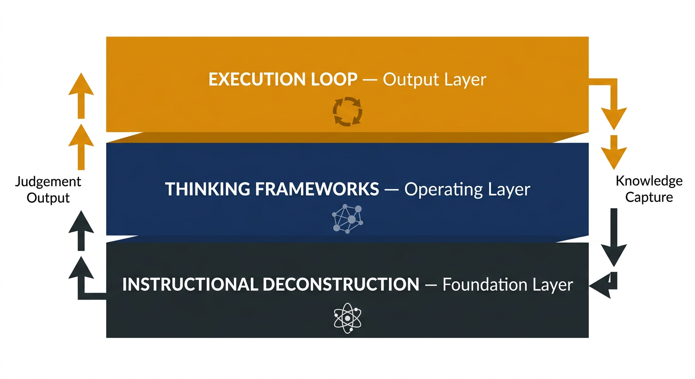

# Section 2 — The Framework: The Human Operating System

---

## 2.1 Framing the Model

Every person who operates in a professional environment is, in effect, running a system. They are processing inputs — problems, information, requests, constraints — and producing outputs — decisions, work, communication, results. The quality of those outputs is determined not just by what they know, but by how their processing works: how they categorise problems, which mental models they apply, how quickly they reach a working hypothesis, and how effectively they update that hypothesis when new information arrives.

The **Human Operating System (HOS)** is a framework for upgrading that processing.

The operating system metaphor is deliberate. An operating system does not determine what a computer can theoretically do — that is set by the hardware. But it determines how efficiently the hardware's capabilities are accessed, organised, and deployed. A computer with excellent hardware running a poorly designed operating system will underperform against a less powerful machine running a better one.

The same is true of professionals. The individual's raw intelligence and domain knowledge are the hardware. The HOS is the software layer that determines how efficiently that hardware converts into judgement and execution.

The model has three layers, each with a distinct function:

- **The Foundation Layer — Instructional Deconstruction:** Breaking complex professional competencies into their smallest executable units. This is where TTLS (Time-to-Learn-Skills) is directly attacked.
- **The Operating Layer — Thinking Frameworks:** A library of open, community-refined mental models across five core professional disciplines. This is where borrowed pattern recognition lives.
- **The Output Layer — The Execution Loop:** The live system through which execution is tracked, intuition is trained, and successful experience is captured as reusable knowledge.

These three layers do not operate in sequence. They operate simultaneously, reinforcing each other. A practitioner using the Execution Loop generates scenarios that sharpen their Thinking Frameworks. Their Thinking Frameworks help them identify which Recipes to deconstruct next. Their Recipes accelerate the formation of the next layer of framework competency.

The system is a flywheel, not a pipeline.

Figure 2. The Human Operating System — Three-Layer Architecture. Each layer builds on the one below it, and feedback flows upward as execution generates new knowledge that refines the layers beneath.

---

## 2.2 What the Model Is Not

Before examining each layer, it is worth being precise about what the HOS is not.

It is not a critique of formal education. Degrees, certifications, and structured learning programmes serve important functions — particularly for building the foundational knowledge base and credentialling that professional communities recognise. The HOS operates *on top of* whatever knowledge base a practitioner already has. It is a method for converting that base into judgement faster, not a replacement for acquiring the base in the first place.

It is not an AI tool. Generative AI appears within the HOS — specifically within the Execution Loop as a scenario generation engine — but the model itself is human-centred. AI is infrastructure. The practitioner's judgement is the product.

It is not a productivity system. The HOS is not primarily about doing more in less time. It is about developing *better pattern recognition*, which then produces faster, more reliable execution as a downstream effect. The goal is expert eyes, not a busier calendar.

---

## 2.3 The Core Principle

The HOS rests on a single, falsifiable premise:

> *Expert judgement is not primarily a function of time invested. It is a function of the quality, volume, and variety of feedback loops experienced during that time.*

If this is true — and the evidence from expertise research strongly suggests that it is — then the question becomes: can we engineer better feedback loops? Can we increase the quality of scenario exposure, reduce the time between action and feedback, and give practitioners a framework for making sense of what they are learning as they learn it?

The answer is yes. The HOS is the architecture for doing so.

---

[← Section 1](section-1-problem.md) | [Section 3 — Instructional Deconstruction →](section-3-deconstruction.md)
