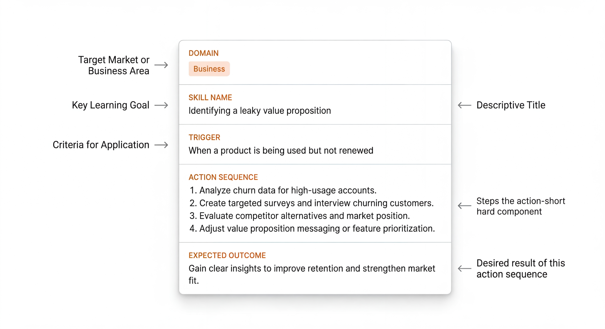

# Section 3 — Pillar One: Instructional Deconstruction

---

## 3.1 The Principle

Every professional competency, no matter how complex it appears from the outside, is composed of smaller, executable units. A senior product manager making a prioritisation decision is not performing one skill — they are performing a rapid sequence of smaller ones: reading a brief for unstated assumptions, categorising the type of problem, selecting the appropriate evaluation framework, stress-testing the leading option against known failure modes, and formulating a recommendation with appropriate confidence.

Each of those smaller skills can be named. Each can be described. Each can be practised in isolation.

**Instructional Deconstruction** is the discipline of finding those units, stripping away the surrounding noise — the jargon, the institutional context, the credential scaffolding — and rendering each one in its minimum viable executable form.

The output of Instructional Deconstruction is a **Career Recipe**: a concise, structured description of a single professional skill unit that a practitioner can read in thirty seconds, understand without prior context, and begin applying immediately.

The Recipe format is deliberately constrained. Constraints are not a limitation here — they are the mechanism. When a competency cannot be described in a Recipe, it is usually because it has not been deconstructed far enough yet. Complexity that cannot be rendered simply is complexity that has not been fully understood.

---

## 3.2 The Career Recipe Format

A Career Recipe has five components:

| Component | Purpose | Example |
|---|---|---|
| **Domain** | Which of the five frameworks this Recipe belongs to | Business |
| **Skill Name** | The specific, nameable thing being described | Identifying a leaky value proposition |
| **Trigger** | The condition under which you deploy this skill | When a product is being used but not renewed |
| **Action Sequence** | The minimum steps to execute it correctly | 1. List what users pay for. 2. List what they actually use. 3. Find the gap. 4. Ask: is the gap a usage problem or a promise problem? |
| **Expected Outcome** | What correct execution produces | A clear hypothesis about whether the retention problem is in the product or the marketing |

Figure 3. Career Recipe Anatomy. Each Recipe is a single, executable skill unit. The five-component structure ensures every Recipe is immediately actionable without additional context.

The Recipe above is not a summary of a course on retention strategy. It is not a framework overview. It is a single, executable skill — the kind of thing an experienced practitioner does *automatically* after having seen the pattern enough times, rendered in a form that a newer practitioner can begin using today.

---

## 3.3 Reducing Time-to-Learn-Skills (TTLS)

**Time-to-Learn-Skills (TTLS)** is the measure of how long it takes a practitioner to go from first encountering a skill to being able to apply it reliably in a real context.

Traditional professional development has chronically inflated TTLS. A course that takes twelve hours to deliver the insight contained in a single Recipe is not providing twelve hours of value — it is providing twelve hours of scaffolding around a kernel of value that could have been delivered in thirty seconds.

This is not an argument against depth. There are professional competencies that require sustained, deep engagement to master — surgical technique, constitutional law, advanced statistical modelling. The HOS does not claim to replace that kind of learning.

What it does claim is this: *the entry point to a skill should not require mastery of that skill.* A practitioner encountering a new domain should be able to get functional quickly — able to apply the core patterns of expert thinking without waiting months to earn the credentials that would officially grant them access to those patterns.

Recipes solve the entry point problem. They give a practitioner the expert move immediately. Depth and nuance come through execution. But the practitioner is executing with expert pattern recognition from day one, not from month twelve.

---

## 3.4 Career Recipes as Institutional Memory

The compounding effect of the Recipe format becomes apparent at scale.

In most organisations, professional expertise is locked inside individual practitioners. When those practitioners leave, their pattern recognition leaves with them. What remains are documents, processes, and systems — artefacts of how the work was done, but not the *judgement* behind how it was done well.

A Recipe library is a different kind of institutional memory. It captures not just what was done, but the *expert thinking* behind it — the trigger conditions that activate a skill, the specific moves that constitute good execution, the expected outcome that signals whether it worked.

A team that systematically converts successful execution into Recipes is building a transferable, compounding asset. Every new practitioner who joins can access the pattern recognition that took years for the founding team to develop. The TTLS for each subsequent practitioner decreases.

This is the compounding effect of Instructional Deconstruction: the more Recipes are written, the faster the next person learns; the faster the next person learns, the more execution they generate; the more execution they generate, the more new Recipes can be written.

---

[← Section 2](section-2-framework.md) | [Section 4 — The Thinking Frameworks →](section-4-frameworks.md)
