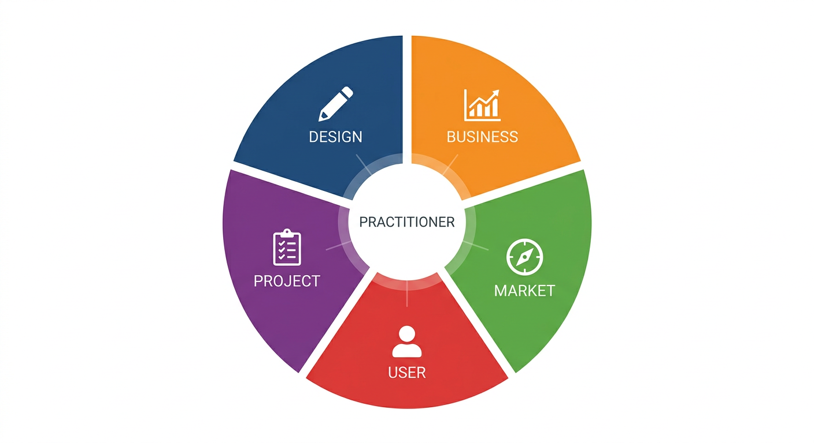

# Section 4 — Pillar Two: The Open Thinking Frameworks

---

## 4.1 What a Thinking Framework Is

A thinking framework is a structured lens for looking at a category of problem.

It is not a methodology in the procedural sense — a step-by-step process that, if followed correctly, will produce the right answer. It is more like a set of questions that an expert in a domain *automatically asks* when they encounter a new situation. The framework tells the practitioner what to look at, what to look for, and what the presence or absence of certain signals typically means.

The difference between a practitioner who has a framework and one who does not is visible in their first sixty seconds with a new problem. The practitioner with the framework immediately begins categorising: what type of problem is this? What are the relevant variables? What have I seen that looks like this before? The practitioner without the framework either reaches for a generic process or waits for context to accumulate before they can begin.

Frameworks are, in essence, borrowed pattern recognition. They are the accumulated expert instinct of people who have spent years developing a feel for a domain, rendered in a form that a newer practitioner can access before they have earned that feel through their own experience.

The HOS maintains five open frameworks — one for each of the core professional disciplines most commonly encountered in high-complexity environments.

While the HOS maintains these five initial frameworks, they are not intended to be an exhaustive list of all professional knowledge. These specific domains were selected because they represent the core disciplines most commonly encountered in the high-complexity technology environments where this model was first developed and tested. If you find that these categories do not sufficiently capture your organization’s specific institutional memory, you are encouraged to 'fork' the framework and build out entirely new domains using the principles of Instructional Deconstruction. We invite you to contribute these back to the project; it is only through this community contribution that the operating system can truly grow and capture the full breadth of expert judgment across all industries.

---

## 4.2 The Five Domains

Figure 4. The Five Domains. The frameworks are not a hierarchy — they are interconnected disciplines that a practitioner moves between fluidly. Mastery in one domain accelerates fluency in the others.

### Design Framework

The Design Framework governs how a practitioner thinks about form, function, and the relationship between a system and the person using it.

Its core questions are: What job is this designed to do? Where does the design create friction it did not intend to? What has been optimised for, and what has been sacrificed in that optimisation? What would this look like if the user's context were different from the designer's assumptions?

The Design Framework is frequently under-applied outside of product and UX roles — yet design thinking (in its precise sense, not its diluted popular sense) is relevant to any situation where a system, process, or communication needs to work reliably for a person who did not design it.

### Business Framework

The Business Framework governs how a practitioner thinks about value creation, economics, and strategic positioning.

Its core questions are: Where does value actually get created in this system? What is the unit economics story? What is being exchanged for what? Who captures the value, and why? What assumptions about the market is this business model dependent on? Where is the model fragile?

The Business Framework is the most commonly taught of the five — business schools, MBA programmes, and strategy courses have produced a large body of accessible literature. The HOS does not aim to replace that literature. It aims to extract the executable core of it: the moves that experienced strategists make automatically, rendered as Recipes that newer practitioners can begin applying immediately.

### Market Framework

The Market Framework governs how a practitioner thinks about competitive dynamics, timing, and demand signals.

Its core questions are: Who else is solving this problem, and how? What does the distribution of existing solutions tell us about what buyers actually value? What is the timing story — is this problem getting more urgent, less urgent, or stable? Where are the unserved segments, and why are they unserved?

Market thinking is distinct from business thinking in a critical way: business thinking looks inward (how does our model work?), while market thinking looks outward (how does the environment we are operating in actually behave?). Both are necessary, and most practitioners are stronger in one than the other.

### User Framework

The User Framework governs how a practitioner thinks about the people their work ultimately serves — their behaviours, motivations, friction points, and feedback loops.

Its core questions are: What is the user actually trying to accomplish — not the stated goal, but the underlying one? Where in their journey does the work we are doing create or remove friction? What would we need to believe about user behaviour for this decision to be correct? How are we currently receiving signal from users, and how much should we trust that signal?

The User Framework is the most commonly misapplied of the five. "We talked to users" is frequently offered as evidence of user-centred thinking — but talking to users and having a rigorous framework for interpreting what they say are different things. The User Framework is primarily about the quality of the interpretation, not the quantity of the research.

### Project Framework

The Project Framework governs how a practitioner thinks about sequencing, resource constraints, risk, and the dynamics of work in progress.

Its core questions are: What is the critical path — the sequence of tasks where delay propagates through everything that follows? Where is the resource constraint, and are we building around it or against it? What are the highest-probability failure modes, and at what point in the project do they become visible? What is the minimum viable version of this that still tests the core assumption?

Project thinking is often treated as a domain of specialists — project managers, programme managers, delivery leads. The HOS treats it as a universal framework because every professional, regardless of role, operates within projects. The practitioner who cannot read a project's dynamics is always dependent on someone else to tell them how the work is going.

---

## 4.3 The Open-Source Contribution Model

These five frameworks are not finished. They are *living documents*.

The HOS treats the frameworks as a community contribution surface — a body of executable professional intelligence that improves through the input of practitioners who use these frameworks in the field, test them against real problems, and identify where the current version is incomplete, imprecise, or wrong.

This is a deliberate design choice. The alternative — a single authority deciding what the frameworks contain — produces frameworks that are authoritative but brittle. They reflect the experience of whoever wrote them, in the contexts those authors happened to work in. They calcify.

A community-maintained framework library is slower to initialise but compounds in quality over time. Practitioners who identify a gap in the Market Framework can contribute a new set of triggering questions. Practitioners who find that a Design Framework Recipe consistently underperforms in hardware contexts can annotate it with the contextual caveat. The frameworks get sharper with use.

The contribution model follows the same licence as the broader HOS infrastructure: open access, attribution required, derivative works permitted and encouraged. The goal is a global, peer-maintained library of executable professional intelligence that anyone, anywhere, can access, apply, and improve.

---

[← Section 3](section-3-deconstruction.md) | [Section 5 — The Execution Loop →](section-5-execution-loop.md)
