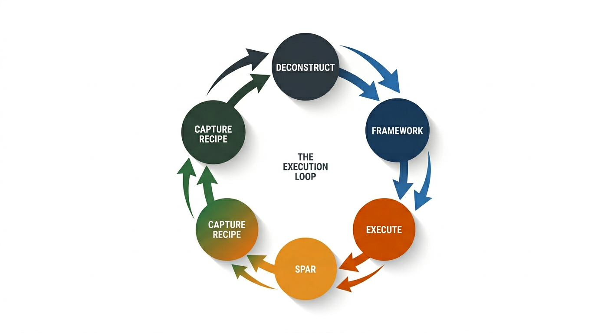

# Section 5 — Pillar Three: The Execution Loop

---

## 5.1 The Problem with Learning That Never Gets Tested

Knowledge that is never tested against reality decays.

This is not a motivational claim. It is a cognitive one. The research on skill retention is consistent: competencies that are not actively used — not just recalled, but *applied* — degrade at a rate that makes even substantial prior investment largely irrelevant within a few years. A practitioner who completes a rigorous course in market analysis and then does not apply market analysis skills in real contexts will find, two years later, that the course has left them with vocabulary and a vague memory of frameworks, but little capacity for reliable execution.

The learning that sticks is the learning that gets used.

This creates a structural problem for professional development. The contexts in which practitioners *most need* to develop new competencies — entering a new domain, pivoting to a new role, joining a new kind of organisation — are precisely the contexts in which they *least have* the opportunity to practise safely. A junior practitioner cannot practise making senior strategic decisions by making senior strategic decisions; the stakes are too high and the feedback too slow.

The Execution Loop addresses this directly by providing two parallel mechanisms: one for tracking and rewarding real-world execution (for the competencies a practitioner already has), and one for safely simulating high-stakes execution in new domains (for the competencies they are still developing).

---

## 5.2 Real-World Execution Tracking

The first mechanism is a gamified execution protocol that makes real-world professional action visible, trackable, and rewarding.

The premise is straightforward: most professionals already do considerable execution each day, but that execution is rarely structured in a way that compounds. Tasks are completed and forgotten. Streaks of high-performance behaviour are not recognised. The pattern recognition being developed through daily work is not being captured as transferable knowledge.

A tracking system built around execution — not around hours spent or credentials earned, but around *things actually done in the world* — creates a different kind of feedback loop. Practitioners see their execution patterns. They identify their domains of strength and the domains where their execution rate is low. They develop streaks that make consistent behaviour more rewarding. And the system provides the structure for converting successful execution into Recipes — the knowledge capture mechanism that closes the loop between doing and knowing.

The design principles for effective execution tracking are:

- **Action-first:** the unit of progress is a completed action, not a completed lesson
- **Domain-tagged:** every execution is associated with one of the five frameworks, building a profile of where the practitioner is generating real output
- **Streak-aware:** consistent execution over time is weighted above sporadic bursts, because consistency is the actual mechanism through which pattern recognition forms
- **Recipe-generating:** the system prompts practitioners to capture the thinking behind successful execution — not just what they did, but why it worked

---

## 5.3 Intuition Sparring

The second mechanism addresses the new-domain problem directly: how does a practitioner develop pattern recognition in a domain they have not yet operated in?

The answer is deliberate practice through scenario sparring.

**Intuition sparring** works as follows. A realistic professional scenario is presented — a product brief, a business model, a market analysis, a user research summary, a project plan. The scenario is plausible. It reads like something a practitioner might encounter in a real context. But it contains a flaw: a logical gap, an unexamined assumption, a misapplied framework, an internal inconsistency.

The practitioner's task is to find the flaw. They have a limited time window. They can select mental cues from a library of framework-relevant prompts that help them structure their analysis. They submit a verdict — naming the flaw and identifying which principle exposes it. Then they receive immediate feedback: what the actual flaw was, which framework it falls under, and how their reasoning compared.

This format — find the flaw, under time pressure, with immediate feedback — is not arbitrary. It is designed specifically to develop the pattern recognition that constitutes expert judgement.

Several features make it effective:

**The flaw-finding framing is more powerful than quiz-based learning.** Quiz formats ask practitioners to retrieve information they already have. Flaw-finding asks them to *apply* frameworks to a novel scenario and form a judgement. The cognitive demand is different, and the skill being trained is different. Retrieval trains memory. Flaw-finding trains evaluation — which is closer to what expert judgement actually requires.

**Time pressure is not cosmetic.** Expert pattern recognition is characterised not just by accuracy but by speed. An expert who reaches the correct diagnosis in ten minutes is closer to a novice than an expert who reaches it in ten seconds. The time constraint trains the practitioner to move faster through the framework, to prioritise signals, and to commit to a hypothesis earlier — all of which are features of genuine expertise.

**Immediate feedback is essential.** The feedback loop cannot be delayed. The value of the scenario is in knowing immediately what the correct pattern was, so the practitioner can calibrate their framework in the moment rather than hours or days later. AI-generated scenarios can deliver this at scale.

**The scenario pool is infinite.** Because the scenarios are AI-generated, there is no fixed curriculum that a practitioner can exhaust. Each round is a new scenario in the same domain. This means the deliberate practice can continue indefinitely — which is necessary, because pattern recognition is not developed in ten rounds. It develops over hundreds.

---

## 5.4 Closing the Loop: From Execution to Recipe

The Execution Loop earns its name from the way its two mechanisms connect.

Real-world execution through the tracking protocol generates successful patterns. Successful patterns are captured as Recipes. Those Recipes are contributed back to the open library — available for the next practitioner entering the same domain to access before they have generated their own execution history.

Simultaneously, the intuition sparring scenarios expose practitioners to the patterns that appear most frequently in high-quality professional work across each domain. The practitioner who has sparred across a hundred Business Framework scenarios has seen a hundred different ways that value propositions can be misaligned, business models can be fragile, or strategic assumptions can be unfounded. Their framework fires faster not because they have a better framework than before, but because they have mapped more territory that the framework applies to.

The flywheel turns: more execution generates more Recipes; more Recipes lower TTLS for new practitioners; more practitioners in the loop generate more varied scenarios; more varied scenarios produce sharper pattern recognition; sharper pattern recognition produces better execution.

Figure 5. The Execution Loop Flywheel. The system is self-improving: execution generates Recipes, Recipes reduce TTLS, reduced TTLS brings more practitioners into the loop, and more practitioners generate more diverse scenarios that sharpen the frameworks for everyone.

---

[← Section 4](section-4-frameworks.md) | [Section 6 — Execution Intuition →](section-6-intuition.md)
